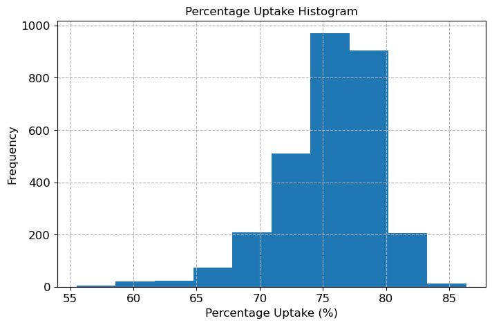
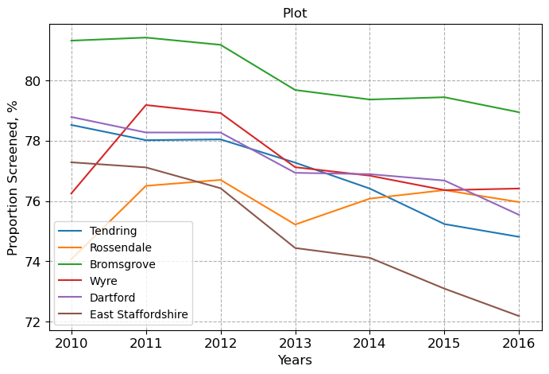
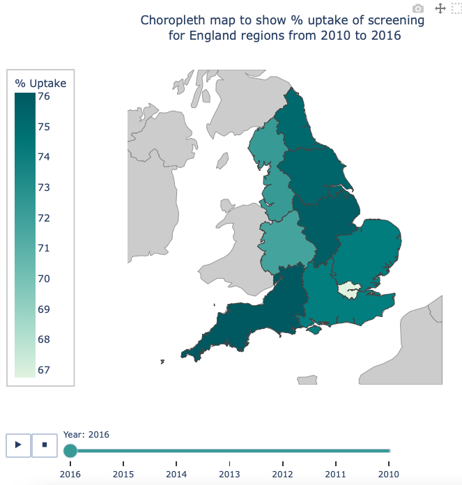
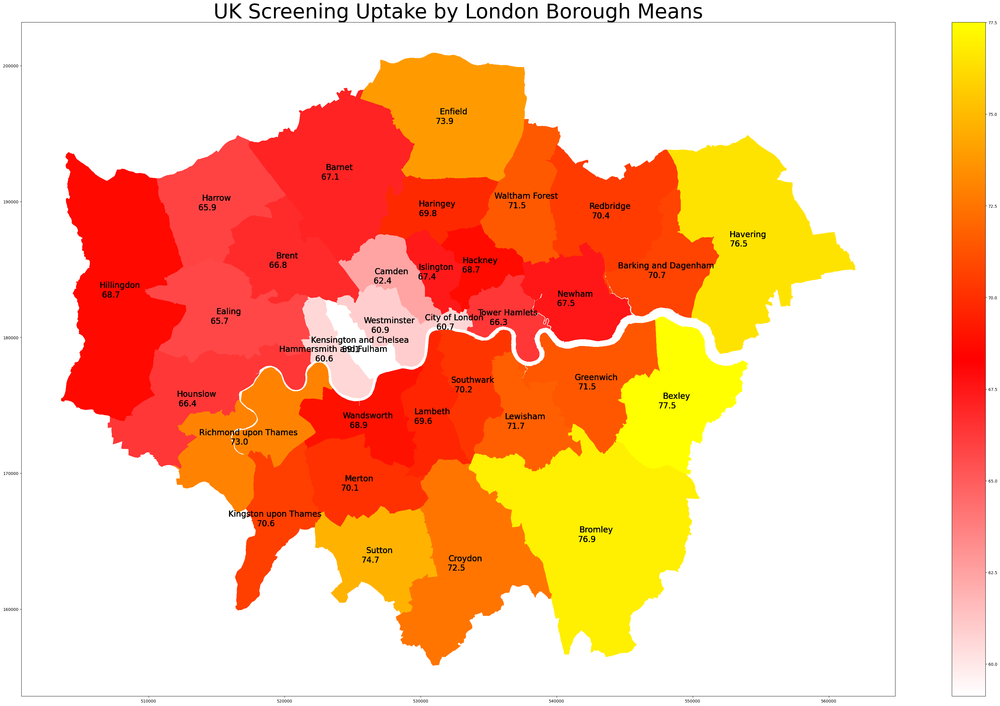
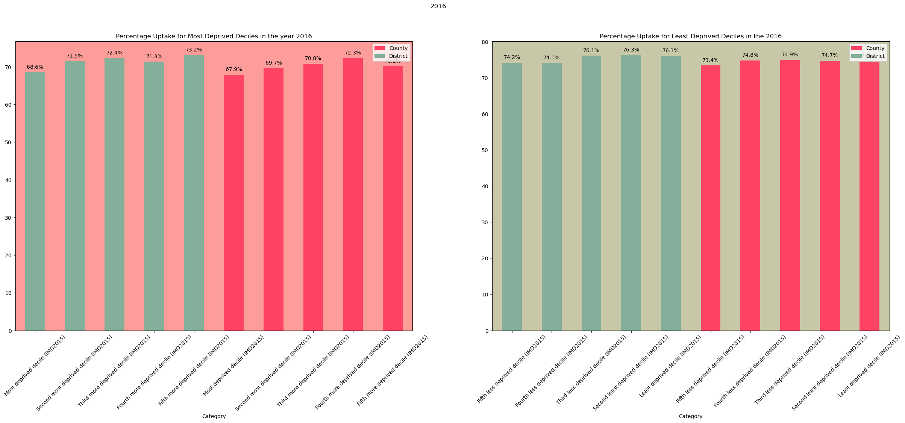
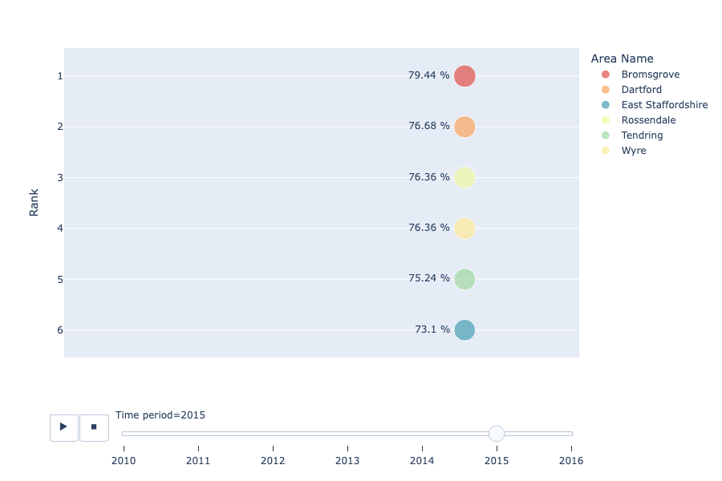
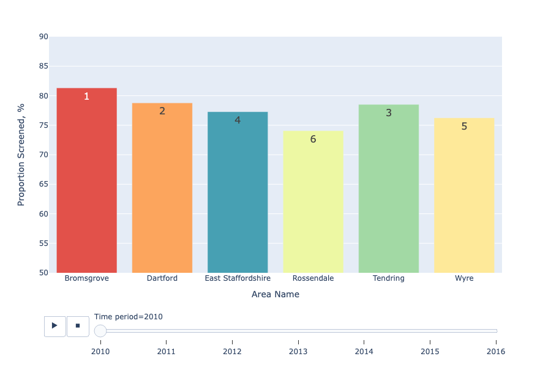
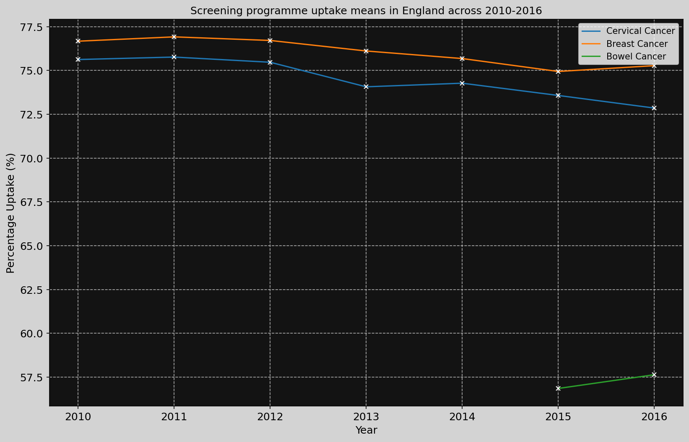

# Visualisation Tools for Screening
## Version 1.0.0

### Table of Contents
1. [Package Purpose](#package-purpose)
2. [Package Aims](#package-aims)
3. [Organisation Overview and Feature Description](#overview)
4. [Installation](#installation)
5. [External References](#refs)
6. [Demo project](#demo)
7. [Example Plots](#plots)

# Package Purpose

In the UK, there are three national screening programmes for cancer: bowel, breast and cervical. The purpose of screening is to detect early signs or increased risk of cancer, and to tailor healthcare accordingly. The aim is more successful treatment or in some instances, prevention of cancer, and therefore better patient outcomes. One clear example of this is in the breast cancer screening programme that was introduced in 1988, which led to significant decreases in mortality from breast cancer over the next 10 years (Blanks, 2000).

Screening uptake datasets can be used to help inform public health policy around screening services, and can provide valuable insights into the effectiveness of current screening programmes. The python package accompanying this user guide offers visualisation tools to help analyse screening uptake datasets, allowing users to quickly and easily create visualisations of relevant data that can be used to inform policy and decision making, especially with application to the National Health Service (NHS) screening programmes for bowel, breast and cervical cancer. 

The package can be used to clean and pre-process NHS screening uptake datasets and generate a variety of different visualisations and can be customised to display data in formats such as histograms, bar charts, lineplots and choropleth maps, making it easy to compare different years and regions. This package can be used to display trends in screening uptake over time, and can be used to identify potential areas for improvement in screening uptake. 

# Package Aims

1. Offer data cleaning and Pre-processing functions for NHS screening uptake datasets
2. To offer high-level visualisation of these datasets and allow user configuration

# Organisation Overview and Feature Description

An overview of the package organisation and features

This python package contains subfolders: 'vis_tools', 'data', 'Shapefiles' and 'testing':
* [vis_tools](visualisation_package/vis_tools) contains files necessary to execute visualisations
    * datasets.py : contains functions for loading and pre-processing NHS screening uptake datasets for cervical, breast and bowel cancer
    * baseline.py : contains classes and functions necessary for creating basic summary statistic graphs, such as histograms and line plots
    * visualisation.py : contains classes and functions for more advanced visualisation tools, such as geographical choropleth maps and rank-based change graphs
* [data](visualisation_package/data) contains sample data files
    * bowel_cancer_data.csv : dataset containing bowel cancer screening programme uptake across the UK from 2010-2016
    * breast_cancer_data.csv : dataset containing breast cancer screening programme uptake across the UK from 2010-2016
    * cervical_cancer_data.csv : dataset containing cervical cancer screening programme uptake across the UK from 2010-2016
* [Shapefiles](visualisation_package/vis_tools/Shapefiles) contains shapefiles necessary for the Choropleth map to run
* [testing](visualisation_package/testing) contains a demo project, demonstrating the functionality and usage of the package

# Installation and setting up environment

A guide on installation of the package
`pip install vistools_for_screening`  

The environment required to run this package is contained in the environment.yml file.  
To set up the environment: `conda env create -n NEW_NAME --file environment.yml` 

# External Resources and References 

(1) Blanks, R.G. (2000) “Effect of NHS breast screening programme on mortality from breast cancer in England and Wales, 1990-8: Comparison of observed with predicted mortality,” BMJ, 321(7262), pp. 665–669. Available at: https://doi.org/10.1136/bmj.321.7262.665. 

# Demo Project 

Please see the [demo.ipynb](visualisation_package/vis_tools/demo.ipynb) file for a Jupyter notebook containing an annotated demo project

# Example Plots

## Basic Descriptive Plots for Data Exploration

## Basic Line Plots to compare areas over a Time period

## Regional and London Analysis Choropleth Maps

## Deprivation Plots

## Rank-based Change Interactive plots

## Country-wide lineplots

